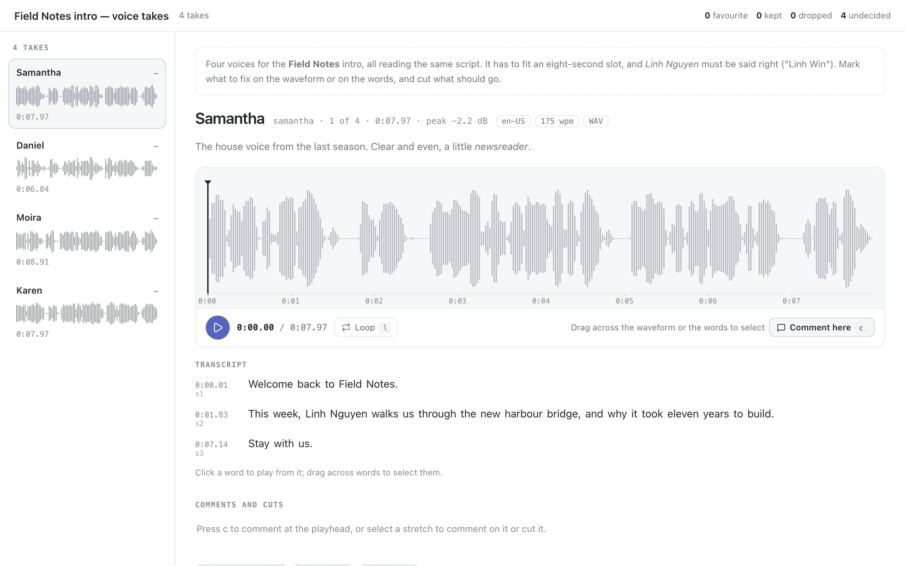

# audio

An agent brings a few audio takes: voices reading the same script, jingle
variants, podcast cuts. You listen to each one the way you would in an editor:

- every take in the rail with its waveform and length;
- the open take on a large waveform, with a playhead you click, drag or move
  with the arrow keys, and its peak level;
- its transcript beside it, when the agent sends one, lit word by word as it
  plays. Click a word to play from it, drag across words to select them;
- the next take at the same point: <kbd>j</kbd> and <kbd>k</kbd> keep your
  place, by the same word when both takes carry word timings, and <kbd>b</kbd>
  jumps back to the take you came from, so an A/B is one key.



On a take you can **comment at a moment** (<kbd>c</kbd> at the playhead) or
**over a stretch** (select it, then <kbd>c</kbd>), and **mark a stretch to
cut** (select it, then <kbd>⌫</kbd>). Overlapping cuts join into one.
*Without cuts* (<kbd>p</kbd>) plays the take as it would be with them removed.
Each take gets a verdict, **favourite**, **keep** or **drop**, with a note.
There is one favourite at most, and a take you commented on or cut counts as
kept unless you say otherwise.

## Asking

```sh
pinrail plugins install ./audio
pinrail submit audio --title "Field Notes intro — voice takes" --data takes.json \
  --attach out/samantha.wav --attach out/daniel.mp3 --wait --format markdown
```

## Payload

```json
{
  "notes": "markdown: what this round is and what to listen for",
  "script": "the text every take reads, shown when a take has no transcript",
  "takes": [
    { "id": "daniel", "name": "Daniel",
      "file": { "$attachment": "daniel.mp3" },
      "details": ["en-GB", "195 wpm"],
      "reasoning": "markdown: what this take tries",
      "transcript": {
        "segments": [
          { "id": "s1", "text": "Welcome back to Field Notes.", "start_ms": 0, "end_ms": 1360,
            "words": [{ "text": "Welcome", "start_ms": 0, "end_ms": 340 }] }
        ]
      } }
  ]
}
```

- **A take** is a file sent with `--attach` and named in `file`: WAV, MP3,
  M4A/AAC, Ogg (Vorbis or Opus) or FLAC, up to 50 MB each and 12 a round.
- **The transcript** is optional. Send `segments` (sentences, lines, turns)
  with an `id` each, so comments and cuts can name the segment to redo; add
  `words` inside them, or a flat `words` list, so a comment can anchor to a
  word. Times are milliseconds from the start of the file. A word aligner's
  timings are enough.

## Decision

```json
{
  "decisions": [
    { "id": "daniel", "action": "favorite", "duration_ms": 6844,
      "note": "The one. Fix the name and slow the middle a touch.",
      "comments": [
        { "start_ms": 2420, "end_ms": 2650, "text": "Nguyen", "words": [8, 8], "segments": ["s2"],
          "note": "Mispronounced: it is \"Win\", one syllable" },
        { "at_ms": 3560, "text": "harbour", "words": [14, 14], "segments": ["s2"], "note": "A breath here" }
      ],
      "cuts": [{ "start_ms": 1560, "end_ms": 1960, "text": "This week,", "words": [5, 6], "segments": ["s2"] }] },
    { "id": "karen", "action": "drop", "duration_ms": 7970, "note": "Too bright for the show." }
  ],
  "undecided": ["samantha", "moira"]
}
```

- A comment is at a moment (`at_ms`) or over a stretch (`start_ms`,
  `end_ms`). `text` is the transcript under it, `words` the first and last
  word as indices into the take's words in order (across segments), and
  `segments` the ids it touches: enough to re-synthesise one segment or one
  word without guessing.
- `cuts` are in time order and never overlap. Apply them from the last to the
  first, and every earlier time still holds.
- `duration_ms` is the take as it was heard, the frame for every time in it.
- For the next round, submit with `--revises <id>`: each take shows the
  verdict it had last time.

## Keys

<kbd>space</kbd> play or pause · <kbd>←</kbd> / <kbd>→</kbd> a second back or
forward, five with <kbd>shift</kbd> · <kbd>0</kbd> the start · <kbd>j</kbd> /
<kbd>k</kbd> next and previous take · <kbd>b</kbd> the take you came from ·
<kbd>i</kbd> / <kbd>o</kbd> start and end a selection at the playhead ·
<kbd>c</kbd> comment · <kbd>⌫</kbd> cut · <kbd>l</kbd> loop the selection ·
<kbd>p</kbd> without cuts · <kbd>f</kbd> favourite · <kbd>s</kbd> keep ·
<kbd>x</kbd> drop.

## Developing

The view is one HTML file with no dependencies: the Web Audio API decodes
each take and a canvas draws its waveform.

- `node scripts/fixture.mjs` writes the Field Notes takes again: four macOS
  voices reading the same intro with `say`, as WAV, MP3 (`lame`), M4A
  (`afconvert`) and Ogg Opus (`ffmpeg`), with word timings found from the
  pauses in each recording. It writes `fixtures/fieldnotes.json`, and the
  decided round beside it.
- `pnpm exec pinrail-sdk dev audio` opens the view on the samples and the
  fixtures, without the app.
- `npx playwright test audio` runs the tests.
