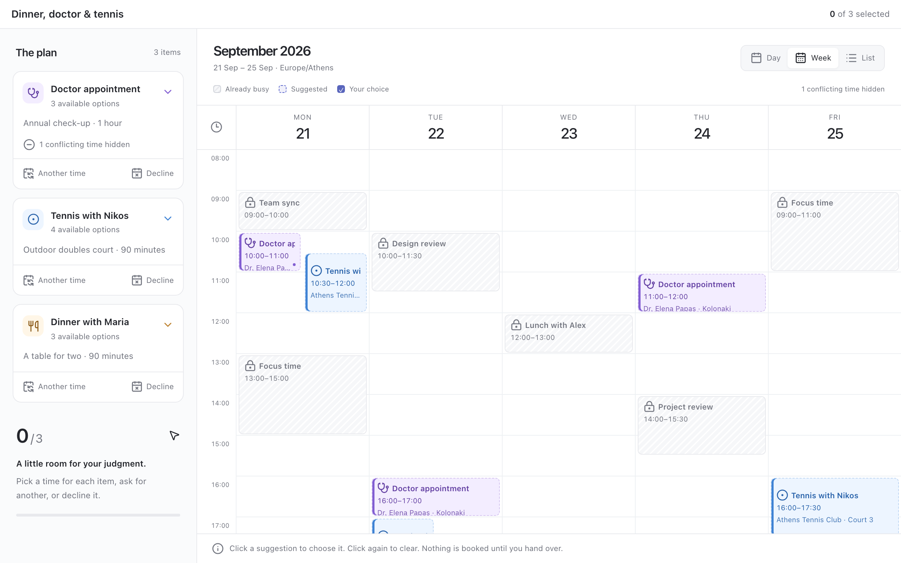

# calendar

A calendar for making decisions about time. Existing commitments are fixed,
striped blocks. Each item to arrange has its own colour and one or more
suggested slots. Click one to choose it; the suggestions it clashes with step
aside, and come back when it is cleared. An item none of whose times work can
be sent back for **another time**, with a note on when would suit, or
**declined** altogether, with a reason if you like.



Three views: **Day** shows one day at full width, with the week's days above
it and how many suggestions each has; **Week** shows up to seven days and pages
through a longer range; **List** shows every suggestion by item. A one-day
calendar opens in the day view, a longer one in the week; the *Opening view*
setting changes that, and the last view picked is kept.

Keys: `d`, `w`, `l` for the views; `j` / `k` next and previous day or week;
`t` back to the first day.

Plain JavaScript and CSS, with no runtime dependencies and no build step. It
runs on the Pinrail SDK and its stylesheet, inside the app's sandboxed frame.

## Asking

```sh
pinrail plugins install ./calendar
pinrail submit calendar --title "Schedule four candidate interviews" --data slots.json --wait
```

The fixtures show the range of it:

- **Personal assistant:** a doctor appointment, tennis and dinner, with
  overlapping suggestions and one suggestion the calendar already blocks.
- **Interviews:** four candidates sharing one interview panel.
- **Decided:** the accepted personal schedule, read-only.
- **No availability:** an appointment that has to be left for the agent.

## Header

The compact toolbar displays the review title supplied by the agent with
`pinrail submit calendar --title "Schedule four candidate interviews"`. It shows
selection progress alongside the title, or the read-only review status. There
is no fixed headline, slogan, or introductory copy.

## Payload

The agent supplies all calendar data. A minimal example:

```json
{
  "timezone": "Europe/Athens",
  "start_date": "2026-09-21",
  "days": 5,
  "blocked": [
    {"id": "standup", "title": "Team stand-up", "start": "2026-09-21T09:00:00+03:00", "end": "2026-09-21T10:00:00+03:00"}
  ],
  "items": [
    {
      "id": "doctor",
      "title": "Doctor appointment",
      "subtitle": "Annual check-up · 1 hour",
      "icon": "stethoscope",
      "options": [
        {"id": "doctor-mon", "start": "2026-09-21T10:00:00+03:00", "end": "2026-09-21T11:00:00+03:00", "location": "Kolonaki", "detail": "€60", "recommended": true},
        {"id": "doctor-thu", "start": "2026-09-24T11:00:00+03:00", "end": "2026-09-24T12:00:00+03:00", "location": "Kolonaki", "detail": "€60"}
      ]
    }
  ]
}
```

IDs are globally unique within a payload. Timestamps need explicit offsets;
all times display in the payload's IANA timezone, independently of the browser's
timezone. `days` supports 1–14 days. Suggested intervals must fit in that window;
blocked events may extend outside it. Overnight events split across columns.

## Decision contract

No submission occurs on slot clicks. Choices are drafts until the shell sends
`collect` (also Cmd/Ctrl+Enter). Every item needs a time, a request for
**another time**, or a **decline**. An unresolved item prevents hand-over.

```json
{
  "verdict": "revise",
  "timezone": "Europe/Athens",
  "selections": [
    {"item_id": "doctor", "option_id": "doctor-mon", "start": "2026-09-21T10:00:00+03:00", "end": "2026-09-21T11:00:00+03:00"}
  ],
  "deferred": ["dinner"],
  "declined": ["tennis"],
  "notes": [
    {"item_id": "dinner", "note": "Friday evening works better"},
    {"item_id": "tennis", "note": "Not this week"}
  ]
}
```

- `approve`: every item has a selected time or was declined.
- `revise`: at least one item needs another time (`deferred`). Selected entries
  remain the person's chosen times; deferred IDs authorize no booking. The
  consuming workflow decides whether to book selected entries now or return a
  complete revised plan first. Do not interpret `revise` as approving deferred
  entries.
- `declined` items are not to be scheduled at all; `notes` holds what the
  person said about an item sent back or declined. Both are left out when empty.
- Returned IDs and timestamps are copied from the selected payload options.
- Restored drafts and submissions are checked again for conflicts. Stale or
  invalid choices cannot silently become authorizations.
- `submitted` freezes the controls; rejected decisions display shell violations.
- A new review round starts fresh unless its shell supplies a draft. Previous
  rounds never silently authorize a new payload's options.

The plugin does not access a live calendar or make bookings. Before executing,
the agent must verify the selected IDs against the original payload, recheck
availability and terms, and request another review if they changed. Exact
interval overlaps conflict; touching endpoints are allowed. Travel time and
preparation buffers must be included in the agent's proposed intervals or
blocked events. The interview fixture assumes a shared panel, so every selected
interview conflicts with an overlapping one; independent resource pools are
not modeled by this version.

## Developing

`pnpm exec pinrail-sdk dev calendar` opens the view in a browser on the
fixtures, without the app. The scheduling rules in `view/calendar-core.js` are
tested on their own in `tests/core.test.cjs`, and the view in
`tests/calendar.spec.ts`; both run with the other samples' tests,
`pnpm test`. `pinrail plugins check calendar` says what the
app would make of the folder.
