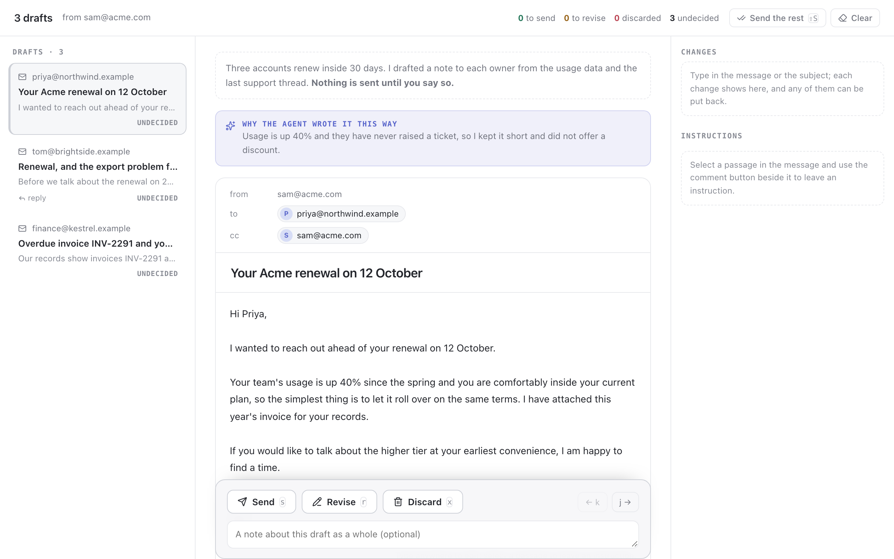

# email

Emails an agent has written and wants to send. The person reads each one, edits
it the way they would edit anyone's writing, hangs instructions on the passages
that need them, and says send, revise or discard. Provider-agnostic: the
requester maps its mailbox into the payload and the decision back out; nothing
here knows what a mail server is.



## Payload

```json
{
  "from": "sam@acme.com",
  "intro": "markdown; why these drafts exist",
  "drafts": [
    { "id": "northwind",
      "to": ["priya@northwind.example"], "cc": [], "bcc": [],
      "subject": "Your Acme renewal on 12 October",
      "body": "plain text, as it would be sent",
      "why": "the agent's reason for writing it this way",
      "thread": [{ "author": "priya@…", "at": "12 June", "body": "…" }] }
  ]
}
```

## What the person does

The drafts sit down a rail, like an inbox, each with its verdict so far; the
open one reads as the message it would be, with the verdict at the foot.

The message is editable where it stands, with the changes tracked, the way
suggestions work in a document editor: type anywhere and what you cut stays on
screen struck through, what you added is marked, so the two versions can be
compared without switching views. The subject is edited in place too, with
what it was shown under it. Every change, subject or body, is listed in the
panel on the right, where each can be put back on its own; undo and redo walk
through them in the order they were made, and Revert all puts a draft back to
the agent's words.

Select any passage and a comment button appears beside it: the instruction is
written in a popover over the passage, in your voice rather than the agent's.
The passage is numbered in the body and the instruction with the same number
is listed in the panel on the right, under the changes. There is also a note
for the draft as a whole.

Each draft gets a verdict. Send means this text, as it stands. Revise means do
not send it, write it again from the instructions. Discard means drop it.
Anything left undecided is reported as undecided and nothing is sent for it.

Keys: `j` / `k` next and previous draft, `s` send, `r` revise, `x` discard,
`shift+s` send every draft still undecided, `e` put the cursor in the message.

## Decision

```json
{
  "drafts": [
    { "id": "northwind", "action": "send",
      "subject": "Your Acme renewal on 12 October",
      "body": "…the final text…",
      "edits": [{ "from": "at your earliest convenience", "to": "this week" }],
      "comments": [{ "quote": "I wanted to reach out", "note": "we don't say reach out" }],
      "note": "good otherwise" }
  ],
  "undecided": ["kestrel"]
}
```

`subject` and `body` are the final text. On `send`, send them as they stand.
On `revise`, write the draft again from `comments` and `note`, then open a new
round that supersedes this review. `edits` says what the person changed and is
the part worth learning from: it is how you find out that this person never
says "reach out".
