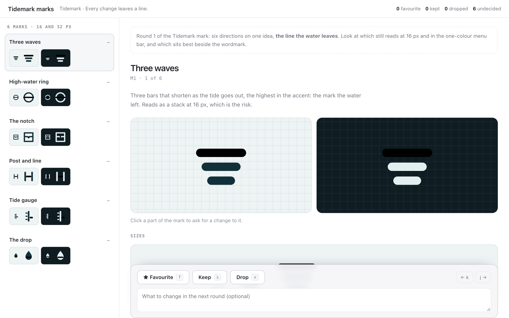

# logo

An agent proposes a few candidate marks; you see each one the way it will
actually live, in the brand's own colours, light and dark:

- every mark side by side at 16 and 32 px, to compare at a glance;
- the chosen mark large on a grid, and on a ladder of sizes from 16 to 128 px;
- as a favicon in a browser tab, an app icon, in the Dock, and in the macOS
  menu bar in one colour, the way template images are drawn;
- beside the wordmark, with the tagline.



For each mark you say **favourite**, **keep** or **drop**, with a note. There
is one favourite at most: choosing another moves the old one to *keep*.

## Asking

```sh
pinrail plugins install ./logo
pinrail submit logo --title "Tidemark marks — round 1" --data marks.json --wait
```

## Payload

```json
{
  "notes": "markdown: what this round is and what to look at",
  "brand": {
    "name": "Tidemark",
    "wordmark": "tide[mark]",
    "wordmark_font": "\"Avenir Next\", system-ui, sans-serif",
    "wordmark_weight": 800,
    "tagline": "Every change leaves a line."
  },
  "palette": {
    "light": { "background": "#eef3f4", "surface": "#f8fbfb", "ink": "#12303a", "muted": "#6b8189", "accent": "#0f8b8d" },
    "dark":  { "background": "#0f1c21", "surface": "#18292f", "ink": "#e3eef0", "muted": "#88a0a7", "accent": "#3cc1c3" }
  },
  "marks": [
    { "id": "M4", "name": "Post and line",
      "svg": "<svg xmlns=\"http://www.w3.org/2000/svg\" viewBox=\"0 0 24 24\">…</svg>",
      "reasoning": "markdown: the idea, and what to look for" }
  ]
}
```

- **The SVG** is a whole `<svg>` with a square `viewBox`. Draw the ink with
  `currentColor` and the accent with `var(--accent)`, so the view can paint it
  on every background. Scripts, `<style>`, event handlers and links outside
  the drawing are removed before it is drawn.
- **The wordmark** sets any part in `[brackets]` in the accent colour. The
  view cannot load fonts, so name one the viewer has, with fallbacks.
- **The palette** is optional; without one, a neutral pair is used.

## Decision

```json
{
  "decisions": [
    { "id": "M4", "action": "favorite", "note": "Tune it at 16 px",
      "comments": [{ "target": "svg > rect:nth-of-type(3)", "tag": "rect", "note": "Lower the line a little" }] },
    { "id": "M1", "action": "keep" },
    { "id": "M2", "action": "drop", "note": "Too close to every other ring mark" }
  ],
  "undecided": ["M3", "M5", "M6"]
}
```

`favorite` is the mark to take forward, `keep` stays on the shortlist, `drop`
is set aside. The note is what to change, or why. For the next round, submit
with `--revises <id>`: each mark shows the verdict it had last time.

## Keys

`j` / `k` next and previous mark · `f` favourite · `s` keep · `x` drop.

## Developing

`pnpm exec pinrail-sdk dev logo` opens the view in a browser on the
fixtures, without the app. Its tests run with the other samples':
`pnpm test`. `pinrail plugins check logo` says what the
app would make of the folder.
