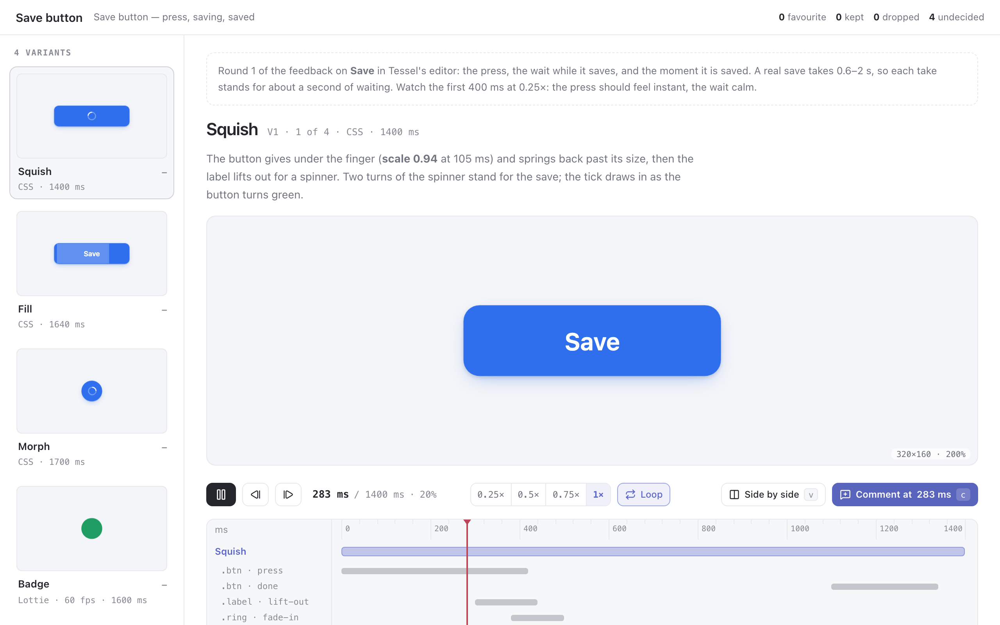

# motion

An agent proposes a few takes on an animation (a loading state, a button's
feedback, a page transition), and you judge them the way motion is judged:
by playing them, slowing them down and stopping on the frame that is wrong.



- Every variant is in the rail, held at a frame from its middle. Hover one to
  play it.
- The chosen variant plays on a stage, with a timeline under it: play and
  pause, scrub, step a frame at a time, run at 0.25×, 0.5×, 0.75× or 1×, and
  loop the whole animation or only a marked stretch of it.
- The timeline has a lane for each animation in the variant (each CSS
  `@keyframes` on its element, or each Lottie layer), so you can see delays,
  staggers and overlaps as well as watch them.
- **Side by side** (`v`) plays up to four variants on one clock, so you see
  their durations and easing against each other. Each lane shows how long its
  variant runs.

You give each variant a verdict, **favourite**, **keep** or **drop**, with a
note. There is one favourite at most: choosing another moves the old one to
*keep*. To ask for a change at a moment, pause there and press `c`. To ask for
a change over a stretch, mark it with `i` and `o`, or shift-drag across the
timeline, and press `c`. A comment keeps its variant on the shortlist.

## Asking

```sh
pinrail plugins install ./motion
pinrail submit motion --title "Save button — round 1" --data variants.json \
  --attach out/badge.json --wait --format markdown
```

## Payload

```json
{
  "subject": "Save button — press, saving, saved",
  "notes": "markdown: what this round is and what to watch",
  "stage": { "width": 320, "height": 160, "background": "#f4f5f8" },
  "variants": [
    { "id": "V1", "name": "Squish",
      "reasoning": "markdown: the idea, and what to look for",
      "html": "<button class=\"btn\"><span class=\"label\">Save</span></button>",
      "css": ".btn { animation: press 420ms cubic-bezier(.3,.7,.4,1) both } @keyframes press { 25% { transform: scale(.94) } }" },
    { "id": "V4", "name": "Badge", "lottie": { "$attachment": "badge.json" }, "loops": false }
  ]
}
```

A variant is **CSS** or **Lottie**, and one review can mix them.

- **CSS**: `html` is placed in a page of its own, centred on the stage, and
  `css` is its stylesheet. Every animation must run from the moment the page
  loads, because nothing is hovered, focused or scripted on the stage. Scripts
  in the markup do not run, and nothing is fetched, so images and fonts go in
  as `data:` URIs. For a loop, stagger with negative `animation-delay` so the
  first cycle is already in step.
- **Lottie**: Bodymovin JSON, as a `.json` file sent with `--attach` (up to
  10 MB), or inline in `lottie` when it is small. It plays in lottie-web's SVG
  player, without expressions.
- **The timeline** runs until the last animation ends, or for one cycle of a
  loop. For Lottie it runs from `ip` to `op`. `duration_ms` sets it yourself.
  `loops` says whether the animation repeats in use: side by side, a loop comes
  round again, and anything else holds its last frame.
- **The stage** is the box the animation plays in, in CSS pixels, over the
  `background` it will sit on. It is set for the whole review or per variant,
  and shown scaled to fit, up to twice its size. `poster_ms` picks the frame
  the rail shows.

## Decision

```json
{
  "decisions": [
    { "id": "V3", "action": "favorite", "note": "The one.", "duration_ms": 1700,
      "comments": [
        { "start_ms": 80, "end_ms": 400, "start": 0.047, "end": 0.235,
          "active": [{ "selector": ".btn", "animation": "shrink", "from": 0, "to": 1 },
                     { "selector": ".label", "animation": "fade-out", "from": 0.4 }],
          "compared_with": ["V1", "V2"],
          "note": "Ease out slower into the circle, over about 450 ms" },
        { "start_ms": 1400, "start": 0.824,
          "active": [{ "selector": ".btn", "animation": "grow", "from": 0.42 }],
          "note": "Less overshoot as it grows back" }
      ] },
    { "id": "V4", "action": "keep", "duration_ms": 1600,
      "comments": [{ "start_ms": 900, "start": 0.563, "frame": 54,
                     "active": [{ "layer": "Check" }, { "layer": "Badge" }],
                     "note": "Pop the badge a touch less" }] },
    { "id": "V2", "action": "drop", "note": "A progress bar promises a length we don't know." }
  ],
  "undecided": ["V1"]
}
```

- `start_ms` is the moment of the comment, in ms from the start of the
  variant's timeline. A comment over a stretch also has `end_ms`. `start` and
  `end` are the same moments as fractions of `duration_ms`.
- `active` is what was animating then. For CSS, each entry names the element
  by a selector within your markup and the `@keyframes` by its name. `from` and
  `to` say how far through the keyframes it was: `0.4` is the 40% keyframe
  position. For Lottie, each entry names a layer, and `frame` and `end_frame`
  are frames in the file's own numbering.
- `compared_with` lists the variants that played beside it when the comment
  was written.

For the next round, submit with `--revises <id>`. Each variant then shows the
verdict it had last time.

## Keys

`space` play or pause · `←` / `→` a frame, with shift 100 ms · `home` / `end`
· `-` / `=` slower and faster · `l` loop · `v` side by side · `i` / `o` mark a
range · `c` comment · `j` / `k` next and previous variant · `f` favourite ·
`s` keep · `x` drop.

## Developing

`npm ci && npm run build` bundles lottie-web into `view/vendor/`. Pinrail
installs a plugin as it is and runs nothing, so build it before you install
or link the folder. `node scripts/fixture.mjs` writes the fixtures and the
small sample again. `pinrail plugins check motion` says what the
app would make of the folder, and `pnpm test` runs its tests with the
others.
