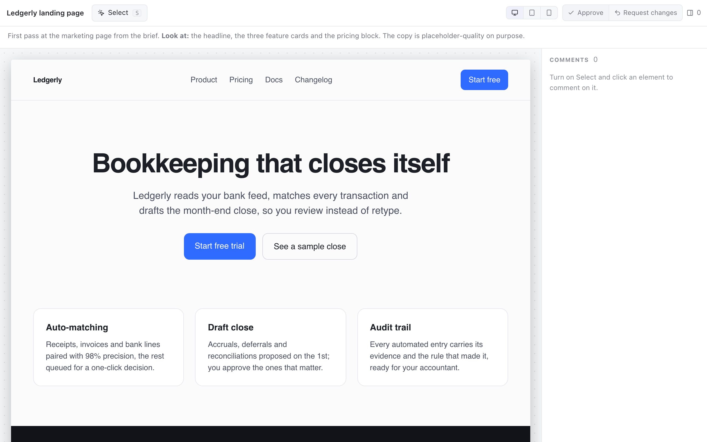

# artifact

An HTML page an agent designed — a mockup, a landing page, an email
template, a dashboard — reviewed the way you would review it in DevTools:
pick an element, say what should change, and the agent gets back a
selector it can act on, not a paragraph it has to interpret.



The reviewer turns on **Select**, hovers to see the element outlined with its
tag, clicks to comment. Each comment is pinned to its element, listed in the
panel, and can be edited or removed. Comments are *change*, *question* or
*keep*. The verdict follows the comments (any comment means *request
changes*) unless the reviewer sets it. Viewport presets show the page at
desktop, tablet and phone widths. A later round shows the previous round's
comments beside the new page.

## Payload

```json
{
  "title": "Ledgerly landing page",
  "notes": "markdown; what to look at",
  "viewport": "desktop",
  "html": "<!doctype html><html>…</html>"
}
```

`html` is the whole document; or, for one already in a file, `"file":
{"$attachment": "landing.html"}` in its place, sent with `--attach
landing.html` (one `.html` file, up to 10 MB). The view renders it in a
shadow root of its
own page, so it must be **self-contained**: `<style>` elements inline,
images and fonts as data URIs. External stylesheets, scripts and images do
not load, links and forms go nowhere, and scripts do not run — the page is
for looking at. `html` and `body` rules in its CSS are applied to the
stand-in for the body.

## Decision

```json
{
  "verdict": "revise",
  "comments": [
    {
      "id": "c_k2n4x9ab",
      "selector": "#hero > h1",
      "tag": "h1",
      "kind": "change",
      "text": "Say what it does, not a slogan",
      "snippet": "Bookkeeping that closes itself",
      "html": "<h1>Bookkeeping that closes itself</h1>"
    }
  ]
}
```

`selector` is relative to `<body>` and unique in the document as reviewed:
the element's own id when it has one, otherwise a path of tags anchored at
the nearest ancestor with an id (`#features > div:nth-of-type(2) > h3`), the
way DevTools copies one. `snippet` and `html` are there so the agent can
find the element again if it has since moved the markup around.

## Building

The view is a React app built with Vite. The build is not checked in: run
it once and the directory is a complete plugin, with `view/index.html` and
`view/assets/` beside the manifest. Until then pinrail lists the plugin as
broken with "entry view/index.html not found".

```sh
npm install
npm run build      # view/index.html and view/assets/
npm run watch      # rebuild on change, with the folder linked (below)
npm test           # the plugin's own tests under the SDK harness
```

Build it before you install it: Pinrail installs a plugin as it is and
runs nothing, and only the bundle enters the app's store.

## Trying it

```sh
pinrail plugins install ./plugins/artifact          # copies the built bundle into the store
pinrail plugins install ./plugins/artifact --link   # or serve the folder live while working on it
pinrail submit artifact --title "Landing page — first draft" \
  --data <(jq .payload plugins/artifact/fixtures/landing.json) --wait
```
