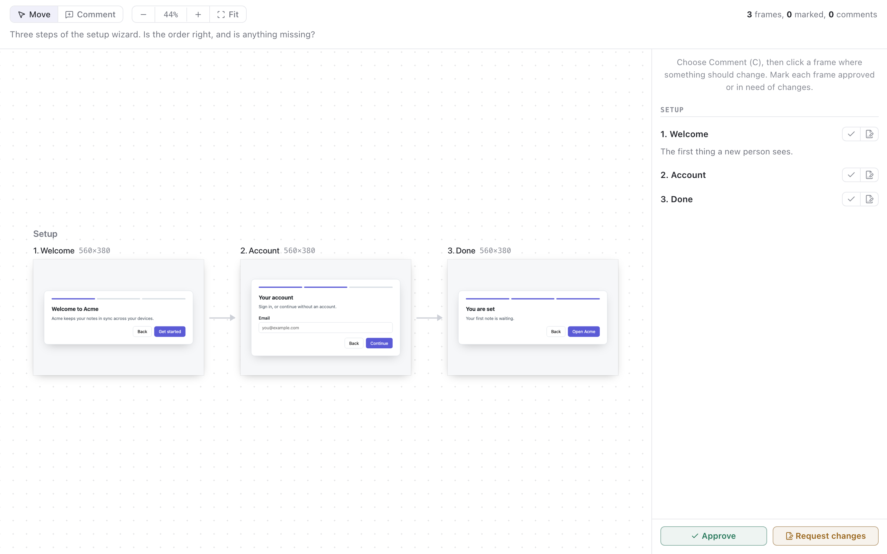

# canvas

A set of designs on a canvas, the way a design tool shows them: the steps
of a wizard, the screens of a flow, or variants of one screen, side by
side. The person pans and zooms, pins comments to any point of a frame,
marks each frame approved or in need of changes, and approves the set or
asks for changes.



- Frames are laid out in rows, one row per `group`, in the order sent.
  With `flow: true`, an arrow joins each frame to the next in its row.
- **Move** (V) drags the canvas. A trackpad or the scroll wheel pans,
  and a pinch or Ctrl with the wheel zooms. Hold Space to drag while
  another tool is on. **Fit** (0) shows every frame, and 1 zooms to
  100 %.
- **Comment** (C) pins a comment where the person clicks. On an HTML
  frame, the element under the pointer is outlined, and the comment
  records its CSS selector. A comment is written in a dialog beside its
  pin. Enter adds it and Escape cancels.
- The side lists every frame with its notes, its two marks (approved,
  needs changes) and its comments. A click on a frame's name or on a
  comment brings the frame into view.

## Payload

```json
{
  "context": "Markdown shown above the canvas.",
  "flow": true,
  "frames": [
    { "id": "welcome", "group": "Setup", "title": "1. Welcome", "width": 560, "height": 380, "html": "<!doctype html>…" },
    { "id": "account", "group": "Setup", "title": "2. Account", "file": { "$attachment": "account.html" } },
    { "id": "shot", "title": "Today's dialog", "image": { "$attachment": "current.png" } }
  ]
}
```

Each frame carries exactly one of `html`, `file` (an `.html` file sent
with `--attach`) or `image` (a PNG, JPEG, WebP, GIF or SVG sent with
`--attach`). An HTML frame is 1280 pixels wide unless `width` says
otherwise. An image is shown at its own size, or scaled to `width` or
`height`. Without `height`, a frame is as tall as its content.

An HTML frame must be self-contained: styles in `<style>` elements, and
images and fonts as data URIs. Scripts do not run, and links and forms go
nowhere. `html` and `body` rules apply to the frame's own body. Use fixed
sizes rather than `vh` and `vw`, which refer to the view, not the frame.

Keep each frame's `id` the same from one round to the next: the next
round lists the previous round's comments by frame.

## Decision

```json
{
  "verdict": "request_changes",
  "frames": [
    { "id": "welcome", "status": "approved" },
    { "id": "account", "status": "changes" },
    { "id": "shot", "status": "unmarked" }
  ],
  "comments": [
    { "id": 1, "frame": "account", "x": 0.5, "y": 0.55, "selector": "#email", "tag": "input", "body": "Say why we ask for an email." }
  ]
}
```

`frames` lists every frame in the order sent. `x` and `y` place a pin as
fractions of the frame's width and height. `selector`, `tag` and
`snippet` are present for a comment on an element of an HTML frame. The
selector is relative to `<body>` and unique in the frame's document.

## Trying it

```sh
pinrail plugins install ./plugins/canvas --link
pinrail submit canvas --sample
pnpm test                          # every plugin's tests
```
