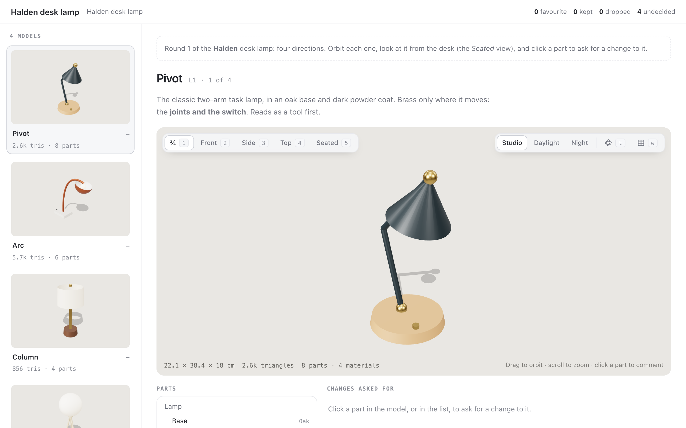

# model-3d

An agent proposes a few candidate 3D models; you look at each one the way you
would look at the real thing:

- every model in the rail, as a still from the same angle, with its triangle
  and part counts;
- the chosen model on a stage to orbit and zoom, from set views (¾, front,
  side, top) and from the views the agent names;
- under studio light, daylight or at night, where what glows shows; on a
  turntable, or as a wireframe;
- with its size in real units, its triangles, parts and materials.



For each model you say **favourite**, **keep** or **drop**, with a note. There
is one favourite at most: choosing another moves the old one to *keep*. Click
a part of the model, or pick it in the list of parts, to ask for a change to
it: the comment is pinned to the point you clicked.

## Asking

```sh
(cd plugins/model-3d && npm ci && npm run build)
pinrail plugins install ./plugins/model-3d
pinrail submit model-3d --title "Halden desk lamp — round 1" --data models.json \
  --attach out/pivot.glb --attach out/column.glb --wait
```

## Payload

```json
{
  "notes": "markdown: what this round is and what to look at",
  "subject": { "name": "Halden desk lamp", "units": "m", "up": "y" },
  "models": [
    { "id": "L1", "name": "Pivot",
      "file": { "$attachment": "pivot.glb" },
      "reasoning": "markdown: the idea, and what to look for",
      "views": [{ "name": "Seated", "position": [0.55, 0.32, 0.55], "target": [0, 0.2, 0] }] }
  ]
}
```

- **A model** is a file sent with `--attach`, which the payload names in
  `file`: a `.glb`, or a `.gltf` with everything embedded, up to 50 MB each and
  12 a round. A small one can go inline instead, as three.js JSON in `object`
  (what `Object3D.toJSON()` returns, images as data URIs). The view fetches
  nothing else, so textures and buffers must be inside the file.
- **Name the nodes.** A comment names its part by the path of node names,
  `Lamp > Head > Shade`, and materials by their names.
- **Units** say what one unit is, for the sizes shown; glTF's metre is the
  default. `up` is `z` for most CAD exports.
- **Views** are cameras in the model's own coordinates. The set ones frame the
  whole model.

## Decision

```json
{
  "decisions": [
    { "id": "L1", "action": "favorite", "note": "Warmer overall",
      "comments": [{
        "target": "Lamp > Lower arm > Upper arm > Head > Shade", "name": "Shade", "material": "Powder coat",
        "point": [0.1712, 0.3391, 0.0189],
        "view": { "position": [0.55, 0.32, 0.55], "target": [0, 0.2, 0] },
        "note": "Wider and shallower, so the bulb is hidden from the chair" }] },
    { "id": "L3", "action": "keep" },
    { "id": "L2", "action": "drop", "note": "A lamp that cannot be aimed is not a desk lamp" }
  ],
  "undecided": ["L4"]
}
```

`favorite` is the model to take forward, `keep` stays on the shortlist, `drop`
is set aside. A comment's `point` is where it was pinned and `view` the camera
it was seen through, both in the model's own coordinates. For the next round,
submit with `--revises <id>`: each model shows the verdict it had last time.

## Keys

`j` / `k` next and previous model · `1`–`9` the views · `t` turntable ·
`w` wireframe · `l` the next light · `f` favourite · `s` keep · `x` drop.

## Developing

`npm ci && npm run build` bundles three.js into `view/vendor/`; run it before
you install or link the folder. `npm run fixture` writes the Halden lamps again, as GLB files
in `fixtures/halden/` with the fixtures that name them.
`pnpm exec pinrail-sdk dev plugins/model-3d` opens the view in a browser on the
fixtures, without the app; its tests run with the other samples':
`pnpm test`.
