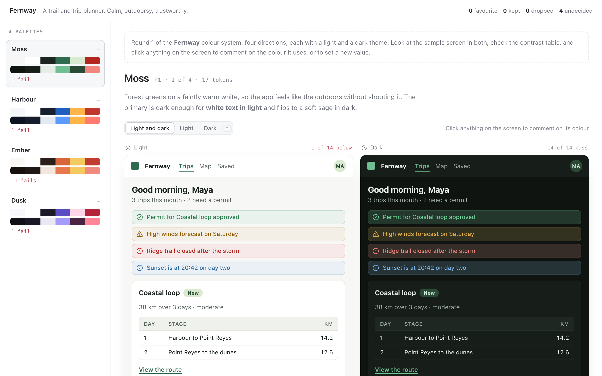

# palette

An agent proposes a few colour systems for a product. You see each one as it
would look in use:

- every palette in the rail, as a strip of its main colours in light and dark,
  with how many contrast checks it fails;
- the chosen palette painted on a sample app screen (top bar, tabs, alerts, a
  card with a table, a link, inputs and buttons), in light and dark side by
  side, or one at a time;
- every token with its light and dark values;
- WCAG 2 contrast for the pairs that matter: body text, secondary text, the
  button's text, links, badges, input outlines, the focus ring and the four
  status messages, plus any pairs the agent adds.



For each palette you say **favourite**, **keep** or **drop**, with a note.
There is one favourite at most: choosing another moves the old one to *keep*.

Click anything on the sample screen, a value in the tokens, or a ratio, to
comment on that colour. The same pop-over takes a new value, typed as any CSS
colour or picked: the screen and the ratios change as you type, and the
pop-over shows each pair the token is in, before and after. New values show on
the screen until you switch them off, to compare with the palette as sent.

## Asking

```sh
pinrail plugins install ./plugins/palette
pinrail submit palette --title "Fernway colours — round 1" --data palettes.json --wait --format markdown
```

## Payload

```json
{
  "notes": "markdown: what this round is and what to look at",
  "subject": { "name": "Fernway", "description": "A trail and trip planner." },
  "checks": [{ "label": "Links on the page", "fg": "primary", "bg": "background", "min": 4.5 }],
  "palettes": [
    { "id": "P1", "name": "Moss", "reasoning": "markdown: the idea",
      "tokens": [
        { "name": "color.bg", "role": "background", "light": "#f7f8f5", "dark": "#0f1411" },
        { "name": "color.primary", "role": "primary", "light": "#2f6b4f", "dark": "#6fbf92" },
        { "name": "color.on-primary", "role": "on-primary", "light": "#ffffff", "dark": "#0b1a12" },
        { "name": "color.accent", "role": "accent", "value": "#ffb547" }
      ] }
  ]
}
```

- **Tokens** go by the names your code uses; comments and new values come back
  by the same names. Each has `light` and `dark` values, or one `value` for
  both themes. Any CSS colour works.
- **Roles** say what a token paints on the sample screen: `background`,
  `surface`, `surface-muted`, `border`, `border-strong`, `text`, `text-muted`,
  `primary`, `on-primary`, `accent`, `on-accent`, `success`, `warning`,
  `danger`, `info`, `focus`. `background`, `surface`, `text`, `primary` and
  `on-primary` are required. A role left out is mixed from the others for the
  screen and is not measured. A token without a role is listed but not drawn.
- **Checks** add contrast pairs beside the standard ones. `fg` and `bg` name a
  token or a role; `min` is the ratio that passes, 4.5 by default.

## Decision

```json
{
  "decisions": [
    { "id": "P1", "action": "favorite", "note": "A touch more contrast in dark",
      "comments": [
        { "token": "color.primary", "role": "primary", "mode": "dark",
          "where": "Primary button", "note": "Warmer, less minty" }
      ],
      "edits": [
        { "token": "color.primary", "role": "primary", "mode": "dark",
          "from": "#6fbf92", "to": "#7cc28a" }
      ] },
    { "id": "P2", "action": "keep" },
    { "id": "P3", "action": "drop", "note": "The orange button fails with white text" }
  ],
  "undecided": ["P4"]
}
```

`favorite` is the palette to take forward, `keep` stays on the shortlist,
`drop` is set aside. A palette with comments or new values and no verdict goes
back as `keep`.

- **`edits`** are values to set as they are: replace the token's `mode` value
  (`light`, `dark`, or `both` for a token sent with one `value`) with `to`.
  `from` is the value you sent, to check against. `to` is `#rrggbb` unless the
  reviewer typed another CSS colour.
- **`comments`** are remarks on one token. `mode` is the theme it was about,
  and `where` the part of the sample screen, or `Contrast: <pair>` when it was
  made on a ratio.

For the next round, submit with `--revises <id>`: each palette shows the
verdict it had last time and how many new values were asked for.

## Keys

`j` / `k` next and previous palette · `m` light and dark, light, dark ·
`e` with or without the new values · `f` favourite · `s` keep · `x` drop ·
`↵` saves the pop-over, `esc` closes it.

## Developing

No build: the view is one HTML file. From the repository's root,
`pinrail plugins check plugins/palette` says what the app would make of
the folder, `pnpm exec pinrail-sdk dev plugins/palette` opens the view on
the samples and the fixtures, and `pnpm test` runs its tests with the
others.

`fixtures/fernway.json` is four palettes for a trail-planning app, one of them
failing on purpose; `fixtures/fernway.decided.json` is the same round decided,
with `fernway.decided.md` the markdown an agent reads for it.
