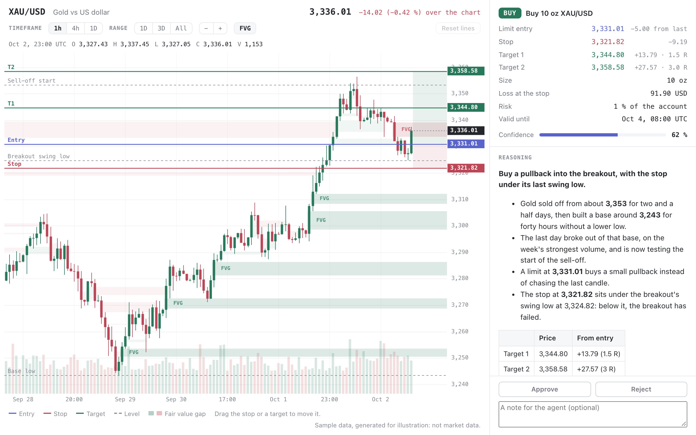

# Trade approval

A trade an agent proposes, shown on the market's candlestick chart with
its entry, stop loss and targets drawn in, beside the agent's reasoning.
The panel lists the proposal's figures: the distance of each price from
the entry, the multiple of the risk that each target makes, and the loss
at the stop. The person can drag the stop and the targets on the chart to
move them, and then approves or rejects the trade, with an optional note.



```sh
pinrail plugins install ./trade --link
pinrail submit trade --sample
pinrail submit trade --title "Buy gold on the pullback" --data payload.json --wait
```

The payload holds the instrument, the timeframe, the candles and the
proposal, with the reasoning in Markdown:

```json
{
  "instrument": { "symbol": "XAU/USD", "name": "Gold vs US dollar", "quote_currency": "USD", "decimals": 2 },
  "timeframe": "1h",
  "candles": [{ "t": "2026-10-02T23:00:00Z", "o": 3327.43, "h": 3337.45, "l": 3327.05, "c": 3336.01, "v": 1153 }],
  "proposal": {
    "side": "buy", "order_type": "limit", "entry": 3331.01, "stop_loss": 3321.82,
    "take_profit": [3344.80, 3358.58], "size": { "quantity": 10, "unit": "oz" },
    "risk_percent": 1, "valid_until": "2026-10-04T08:00:00Z"
  },
  "reasoning": "**Buy a pullback into the breakout.** …",
  "confidence": 0.62,
  "levels": [{ "price": 3324.82, "label": "Breakout swing low", "kind": "support" }],
  "source": "Where the candles come from"
}
```

The decision is `{"verdict": "approve" | "reject", "note": "…"}`. When the
person moved the stop, it also holds `stop_loss`, the stop to use instead.
When they moved a target, it holds `take_profit`, every target in the
proposal's order. A stop or target cannot be dragged across the entry, and
Reset lines puts them back where the agent proposed them.

The chart marks the fair value gaps of the timeframe shown: three candles
where the first and the third do not overlap. A bullish gap is green and a
bearish gap is red. A gap shows from its middle candle until a later candle
trades through all of it. A gap that is still open reaches the right edge
and is labelled FVG. The FVG button hides them.

The chart shows the latest 120 candles. The timeframe buttons merge the
candles into longer ones, such as 4h or 1D, and the range buttons show the
last day, the last three days, or every candle. The mouse wheel or a pinch
zooms, dragging the chart or scrolling sideways pans, and a double click
returns to the latest candles. Times are in UTC.

The sample's candles are generated for illustration. They are not market
data, and the sample trade is not a recommendation.
