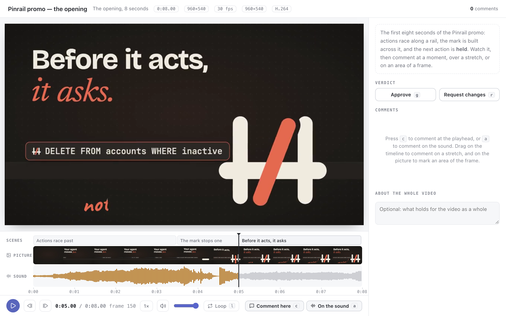

# video

An agent brings a video: a promo cut, a screen recording, a rendered
animation, a generated clip. You watch it and say what to change, and every
comment goes back with the moment it is about.



- The video plays on a stage, as large as the window allows.
- A timeline under it shows the scenes the agent named, the picture as a
  strip of the video's frames with the comments on it, and the sound as a
  waveform with the comments on it.
- <kbd>space</kbd> plays and pauses. <kbd>←</kbd> and <kbd>→</kbd> step one
  frame, and with <kbd>shift</kbd> one second. <kbd>-</kbd> and <kbd>=</kbd>
  change the speed, from 0.25× to 2×. <kbd>m</kbd> mutes.

You can comment in four ways:

- **At a moment.** <kbd>c</kbd> comments on the picture at the playhead, and
  <kbd>a</kbd> comments on the sound there.
- **Over a stretch.** Drag across the picture lane or the sound lane of the
  timeline, or press <kbd>i</kbd> and <kbd>o</kbd> where the stretch starts
  and ends, then comment. A stretch dragged on the sound lane is a comment on
  the sound. Shift and a click on a scene selects the whole scene. Each limit
  of the stretch has a handle to drag. The video goes to the frame under the
  pointer as you drag out a stretch and as you drag a limit. The handles
  come back when you edit a comment on a stretch. **Play selection**, in the
  transport and in the comment's dialog, plays the stretch from its start to
  its end, as <kbd>shift</kbd> and <kbd>space</kbd> do.
  <kbd>l</kbd> loops the stretch, and the ready phrases "Make this shorter",
  "Hold this longer" and "Cut this" fill the comment in one click.
- **On an area of a frame.** Drag a box on the picture, or click a spot while
  a comment is open. The area is shown again whenever the playhead is on the
  comment.
- **On the whole video**, in the note beside the verdict.

The comment you are writing is a dialog on top of the video. It opens beside
the area it marks, or above its moment or stretch on the timeline, and you
can move it by its top line when it covers what you want to see.

The verdict is **approve** or **request changes**. A video with comments and
no verdict counts as changes requested. With neither, the hand-over asks for
a verdict first. <kbd>n</kbd> and <kbd>p</kbd> go from one comment to the
next. A click on a comment, in the list or on the timeline, opens it again:
the video goes to its moment, the dialog shows its words, its area is back on
the frame, and a stretch shows its two limits to drag. Each comment can be
changed or removed until the review is handed over.

## Asking

```sh
pinrail plugins install ./video
pinrail submit video --title "Launch teaser — cut 2" --data teaser.json \
  --attach out/teaser.mp4 --wait
```

## Payload

```json
{
  "name": "Launch teaser, cut 2",
  "file": { "$attachment": "teaser.mp4" },
  "notes": "markdown: what this cut is, and what to look or listen for",
  "fps": 30,
  "scenes": [
    { "id": "intro", "name": "Intro", "start_ms": 0, "end_ms": 3000 },
    { "id": "demo", "name": "Demo", "start_ms": 3000, "end_ms": 9000 }
  ],
  "details": ["1920×1080", "H.264"]
}
```

- **The video** is one file sent with `--attach` and named in `file`, up to
  100 MB. MP4 with H.264 and AAC plays wherever the app runs. WebM plays
  where the platform decodes it.
- **`fps`** is optional. A player cannot read a file's frame rate, so state
  it when you work in frames: the arrow keys then step exactly one frame, and
  every comment comes back with frame numbers. Without it, a step is 1/30 s
  and comments carry times only.
- **`scenes`** are optional. The timeline draws them, and each comment comes
  back with the ids of the scenes it touches. Give each scene the id you know
  it by, such as a component or a file, so a comment leads you straight to
  the code or the shot to change.
- **`sound`** is optional: the sound track as a file of its own (M4A, MP3 or
  WAV). The view reads the waveform from the video itself, so send this only
  when the waveform does not show without it.

## Decision

```json
{
  "verdict": "request_changes",
  "note": "Close. Two things on the picture and one on the sound.",
  "video": { "duration_ms": 6000, "width": 640, "height": 360, "fps": 30 },
  "comments": [
    { "on": "picture", "at_ms": 1017, "at_frame": 30, "scenes": ["open"],
      "region": { "shape": "box", "x": 0.1, "y": 0.2, "width": 0.3, "height": 0.25,
                  "px": { "x": 64, "y": 72, "width": 192, "height": 90 } },
      "note": "This corner is too busy" },
    { "on": "picture", "start_ms": 2000, "end_ms": 4000, "start_frame": 60, "end_frame": 119,
      "scenes": ["middle"], "note": "Make this shorter" },
    { "on": "sound", "start_ms": 3000, "end_ms": 5000, "start_frame": 90, "end_frame": 149,
      "scenes": ["middle", "close"], "note": "The beep is too loud here" }
  ]
}
```

- **`on`** says what a comment is about: `picture` or `sound`.
- A comment is at a moment (`at_ms`) or over a stretch (`start_ms` and
  `end_ms`), never both. `end_frame` is the last frame of the stretch,
  inclusive.
- **`region`** is the area of the frame a picture comment marks: a `box` or a
  `point`, as fractions of the frame from its top left, and the same place in
  the video's own pixels under `px`.
- **`video`** is the video as it was watched, the frame of reference for
  every time and place.
- After `request_changes`, apply the comments and send the next cut with
  `--revises <id>`. The view then lists the earlier round's comments beside
  the new cut, and a click on one goes to the same moment in it.

The agent reads the decision as markdown:

```text
**Changes requested**: Test pattern (0:06.00, 640×360, 30 fps)

> Close. Two things on the picture and one on the sound.

## Comments

1. **picture** at 0:01.01 (1017 ms, frame 30) in `open`, area 64,72 192×90 px: This corner is too busy
2. **picture** 0:02.00–0:04.00 (2000–4000 ms, frames 60–119) in `middle`: Make this shorter
3. **sound** 0:03.00–0:05.00 (3000–5000 ms, frames 90–149) in `middle`, `close`: The beep is too loud here
```

## Try it

```sh
pinrail submit video --sample                        # eight seconds of the Pinrail promo
pinrail submit video --request fixtures/clip.json    # a six-second test pattern
pnpm exec pinrail-sdk dev video                      # the view in a browser, on the sample and the fixtures
```

## Not included

- Drawing on the frame beyond a box and a spot.
- Two cuts playing side by side.
- A transcript or captions beside the sound.
