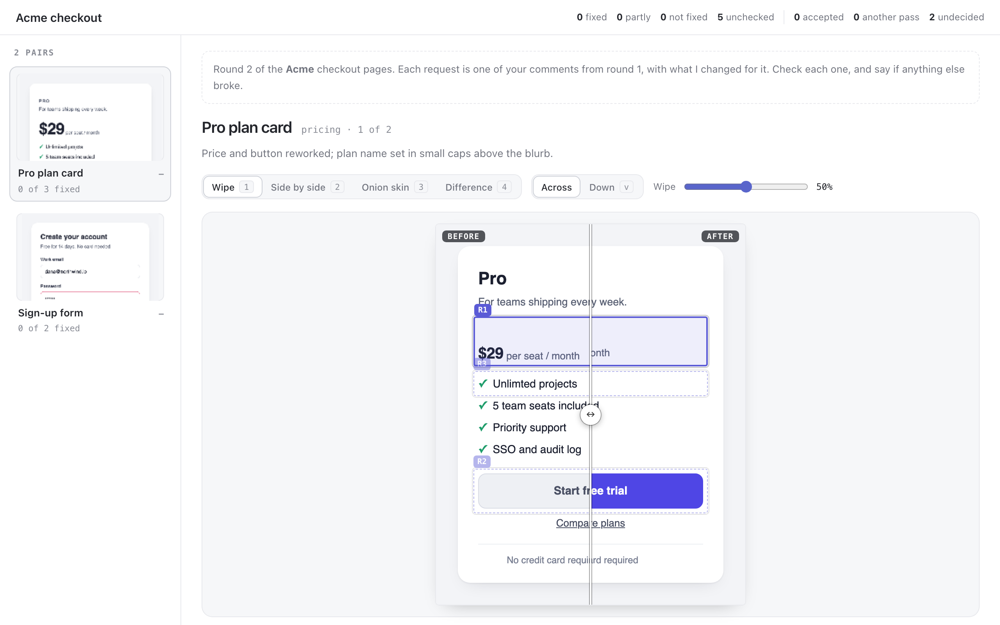

# visual-diff

A review of a revision: did it fix what was asked, and did anything else
break? The agent sends before and after images of each thing it changed
(page screenshots, images, renders), and with each pair the requests it
claims to address. You check each one against the images:

- **Wipe**: the before image left of a divider and the after image right of
  it (or above and below). Drag the divider, or use the arrow keys.
- **Side by side**, with each request's region marked on both images.
- **Onion skin**: the after image faded over the before one.
- **Difference**: every changed pixel lit on a faded after image, the
  changed areas boxed, and the areas outside every request listed apart:
  those are the changes nobody asked for.



For each request you mark **fixed**, **partly** or **not fixed**, with a
note. Drag on the image to mark a region of the after image that broke, or
click for a point. Each pair gets a verdict: **accept**, or **another pass**.
Without one, a pair with anything not fixed or anything new goes back for
another pass, and one whose every request is fixed is accepted.

## Asking

```sh
pinrail plugins install ./visual-diff
pinrail submit visual-diff --title "Acme checkout — round 2" --data pairs.json \
  --attach out/pricing-before.png --attach out/pricing-after.png \
  --wait --format markdown
```

## Payload

```json
{
  "notes": "markdown: what this round is and what to look at",
  "pairs": [
    { "id": "pricing", "name": "Pro plan card",
      "before": { "$attachment": "pricing-before.png" },
      "after": { "$attachment": "pricing-after.png" },
      "pixel_ratio": 2,
      "summary": "markdown: what changed",
      "requests": [
        { "id": "R3", "text": "“Unlimted projects” is misspelled.",
          "region": { "x": 0.12, "y": 0.35, "w": 0.76, "h": 0.07 },
          "after_region": { "x": 0.12, "y": 0.38, "w": 0.76, "h": 0.07 },
          "claim": "Fixed the typo." }
      ] }
  ]
}
```

- **Images** are files sent with `--attach`: PNG, JPEG, WebP, GIF or SVG,
  up to 20 MB each and 12 pairs a round. The two images of a pair should
  show the same view. When they differ in size, the before image is scaled
  to the after image's width and they are compared from the top.
- **`pixel_ratio`** is 2 for a retina screenshot, so the images show at
  their real size. Coordinates that come back are in the image's own
  pixels either way.
- **A request** is what was asked last round, with an `id` that stays the
  same across rounds. `region` is where it was asked, on the before image;
  `after_region` is where its change is, on the after image, when it moved.
  Regions are fractions of the image's width and height, from the top left.
  `claim` says what was done for it.

## Decision

```json
{
  "decisions": [
    { "id": "pricing", "action": "revise", "note": "The typo and the footer, then it can ship.",
      "requests": [
        { "id": "R1", "outcome": "fixed" },
        { "id": "R3", "outcome": "not_fixed", "note": "Still misspelled, now as “projcts”." }
      ],
      "unchecked": ["R2"],
      "comments": [
        { "note": "“Cancel anytime” is gone from the footer. Put it back.",
          "region": { "x": 0.1212, "y": 0.8267, "w": 0.7576, "h": 0.087 },
          "pixels": { "x": 96, "y": 805, "w": 600, "h": 85 } }
      ] }
  ],
  "undecided": ["signup"]
}
```

`action` is `accept` or `revise`. Each checked request comes back with its
`outcome`: `fixed`, `partly` or `not_fixed`, and a note on what is still
wrong. `unchecked` lists the requests nobody gave an outcome. `comments` are
new problems, each on the after image, as fractions of its size (`w` and `h`
are 0 for a point) and in its own pixels. `undecided` lists the pairs left
without a verdict or any outcome.

With `--format markdown`, the agent reads the pairs sent back first, each
with what is still wrong, then what was fixed and what was accepted. For
the next round, submit with `--revises <id>` and keep the request ids: each
request shows what was said about it last time.

## Keys

`j` / `k` next and previous pair · `1` wipe · `2` side by side · `3` onion
skin · `4` difference · `v` wipe across or down · `←` / `→` move the wipe,
the fade or the sensitivity (`shift` for bigger steps) · `n` / `shift+n` next
and previous request · `f` fixed · `p` partly · `x` not fixed · `a` accept ·
`r` another pass. In the difference, `tab` reaches each changed area and
`enter` comments on it.

## Developing

`node visual-diff/scripts/fixture.mjs` draws the Acme pages again, before
and after, as PNGs in `fixtures/acme/` with the fixtures that name them.
`pnpm exec pinrail-sdk dev visual-diff` opens the view on the samples and
the fixtures, and `pnpm test` runs its tests with the others.
